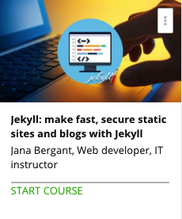

```
Roberto Nogueira  
BSd EE, MSd CE
Solution Integrator Experienced - Certified by Ericsson
```
# Udemy Sites and Blogs with Jekyll



**About **

Learn everything you need to about the subject of this `Udemy` project.

[Homepage](https://www.udemy.com/static-website-generator-fast-secure-sites-blogs-with-jekyll/)

## Topics
```
Section: 1
0 / 2
Introduction
[x] 1. Introduction 2:43
[x] 2. Benefits of a static page and static website generators 0:00

Section: 2
0 / 3
Jekyll basics - important first steps
[x] 3. Install Jekyll - update to version 3.3.0 2:06
[x] 4. Create new project with Jekyll - updated 2:47
[x] 5. Jekyll templates 5:33

Section: 3
0 / 5
Create a page with Jekyll
[x] 6. How to create default layout 6:53
[x] 7. DRY principles 6:35
[x] 8. Jekyll configuration 4:14
[x] 9. Jekyll in-depth 5:39
[ ] 10. How to create a menu 5:19

Section: 4
0 / 6
Create a blog with Jekyll
[ ] 11. Create posts for the blog 2:13
[ ] 12. Add content to posts (part 1) 6:07
[ ] 13. Add content to posts (part 2) 6:25
[ ] 14. Add widgets to post 5:35
[ ] 15. The post loop 3:58
[ ] 16. How to set default values 4:38

Section: 5
0 / 5
Jekyll: What about comments, forms, custom data and other dynamic add-ons
[ ] 17. Contact form is alive! 9:14
[ ] 18. Jekyll data - how to read and use data from external files 5:17
[ ] Quiz 1: Jekyll data 0:00
[ ] 19. How to add projects from json file 8:42
[ ] 20. How to add comments to blog posts 5:10

Section: 6
0 / 3
GitHub pages
[ ] 21. About GitHub Pages 5:43
[ ] 22. Let's publish website on GitHub via Projects Pages 12:28
[ ] 23. Setup a custom domain on GitHub pages 5:26

Section: 7
0 / 4
Archive: old versions
[ ] 24. Introduction 0:00
[ ] 25. Install Jekyll 2:42
[ ] 26. Create a new project with Jekyll 1:53
[ ] 27. How to start a Jekyll server 4:03

Section: 8
0 / 2
Conclusion & Bonus lecture
[ ] 28. Conclusion 0:00
[ ] 29. Bonus Lecture: Discount coupons for my students 0:00
```
